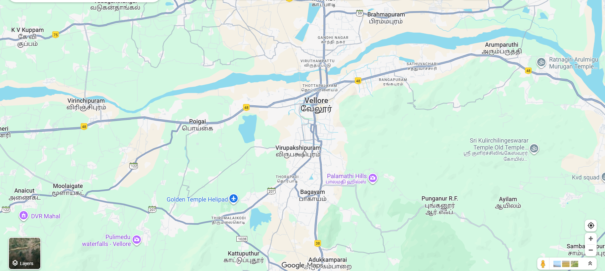

# Ex04 Places Around Me
## Date: 29/09/2025

## AIM:
To develop a website to display details about the places around my house.

## DESIGN STEPS

### STEP 1:
Create a Django admin interface.

### STEP 2:
Download your city map from Google.

### STEP 3:
Using ```<map>``` tag name the map.

### STEP 4:
Create clickable regions in the image using ```<area>``` tag.

### STEP 5:
Write HTML programs for all the regions identified.

### STEP 6:
Execute the programs and publish them.

## CODE :
~~~
map.html

<!DOCTYPE html>
<html>
<head>
<title>Vellore Map</title>
</head>
<body>
<h1 align="center"</h1>
<font color="red"><b>Vellore Map</b></font>    
</h1>
<h3 align="center">
<font color="blue"><b>NAVEEN M(25017603)</b></font>
</h3>
<center>
<!-- Image Map Generated by http://www.image-map.net/ -->


<map name="image-map">
    <area target="_blank" alt="Waterfalls" title="Waterfalls" href="pulimedu.html" coords="234,767,444,700" shape="rect">
    <area target="_blank" alt="Hills" title="Hills" href="palamathi.html" coords="972,568,1148,515" shape="rect">
    <area target="_blank" alt="Temple" title="Temple" href="srikulirchilingeswar.html" coords="1383,502,1638,402" shape="rect">
    <area target="_blank" alt="Airport" title="Airport" href="goldentemple.html" coords="507,644,725,578" shape="rect">
</map>
</center>  
</body>
</html>


pulimedu.html

<html>
    <head>
    <title>My hometown</title>
    </head>
    <body bgcolor="purple">
    <h1 align="center">
    <font color="red"><b>Vellore Map</b></font>    
    </h1>    
    <h3 align="center">
    <font color="Green"><b>Pulimedu hometown</b></font>    
    <hr size="3" color="red">
    <p align="justify">
    <font face="Georgia" size="5" color="White">
    Waterfalls can be formed in several ways, but the most common method of formation is that a river courses over a top layer of resistant bedrock before falling onto softer rock, which erodes faster, leading to an increasingly high fall. Waterfalls have been studied for their impact on species living in and around them.

Humans have had a distinct relationship with waterfalls since prehistory, travelling to see them, exploring and naming them. They can present formidable barriers to navigation along rivers. Waterfalls are religious sites in many cultures. Since the 18th century, they have received increased attention as tourist destinations, sources of hydropower, and—particularly since the mid-20th century—as subjects of research. </font>    
    </p>    
    </body>
</html>


palamathi.html

<html>
    <head>
    <title>Hills</title>
    </head>
    <body bgcolor="purple">
    <h1 align="center">
    <font color="red"><b>Vellore Map</b></font>    
    </h1>    
    <h3 align="center">
    <font color="Green"><b>Palamathi hills</b></font>    
    <hr size="3" color="red">
    <p align="justify">
    <font face="Georgia" size="5" color="White">
    A hill is a landform that extends above the surrounding terrain. It often has a distinct summit, and is usually applied to peaks which are above elevation compared to the relative landmass, though not as prominent as mountains. Hills fall under the category of slope landforms. </p>    
    </body>
</html>


srikulirchilingeswarar.html

<html>
    <head>
    <title>Temple</title>
    </head>
    <body bgcolor="purple">
    <h1 align="center">
    <font color="red"><b>Vellore Map</b></font>    
    </h1>    
    <h3 align="center">
    <font color="Green"><b>Srikulirchilingeshwar Temple</b></font>    
    <hr size="3" color="red">
    <p align="justify">
    <font face="Georgia" size="5" color="White">
   Chadhurdisai Sri Kulirchilingeswarar Temple is located in Punganoor in Ranipet District. The exact name of this place is known as Ayilam. Punganoor and Kathiyavadi are equi distant from here. This Temple is located amidst a dense forest. Devotees could reach the open air Temple through a single muddy and rickety road. On reaching the Temple there is a huge black South facing Idol of Ganapathy who has to be Prayed first. The Presiding Deity of this Temple is Sri Kulirchi Lingeswar and He is an incarnation of God Shiva.   </p>    
    </body>
</html>


goldentemple.html

<html>
    <head>
    <title>Golden temple</title>
    </head>
    <body bgcolor="purple">
    <h1 align="center">
    <font color="red"><b>Vellore Map</b></font>    
    </h1>    
    <h3 align="center">
    <font color="Green"><b>Golden temple</b></font>    
    <hr size="3" color="red">
    <p align="justify">
    <font face="Georgia" size="5" color="White">
   Sri Lakshmi Narayani Golden Temple complex inside the Thirupuram spiritual park is situated at the foot of a small range of green hills at Thirumalaikodi (or simply Malaikodi) Vellore in Tamil Nadu, India. It is 120 km from Tirupati, 145 km from Chennai, 160 km from Pondicherry and 200 km from Bengaluru. The Maha Kumbhabhishekam or consecration of the temple and its chief deity, Sri Lakshmi Narayani or Maha Lakshmi, the goddess of wealth, power and prosperity, was held on 24 August 2007, and devotees from all religions and backgrounds are welcome to visit. </p>    
    </body>
</html>


~~~

## OUTPUT:


## RESULT:
The program for implementing image maps using HTML is executed successfully.
